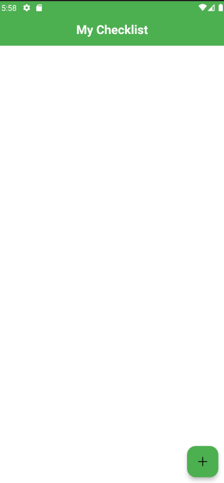
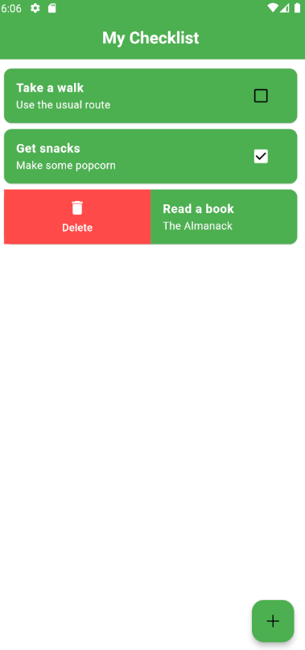

# Checklist

> A local-first cross-platform checklist

## Preview

<div style="display: flex;">
  
  
</div>

## Local installation

Get the latest version of checklist from the [releases page](https://github.com/MarvinKweyu/checklist/releases). This includes installables for:

- Android
- Windows (In progress)

## Development

For local development, clone the repo, install the dependencies and run the project for your environment

```
flutter pub get
flutter run
```